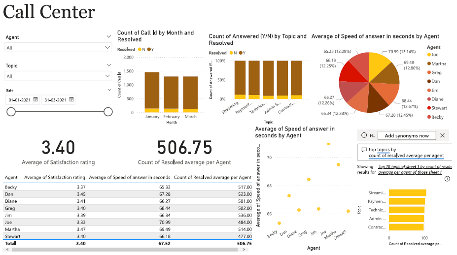
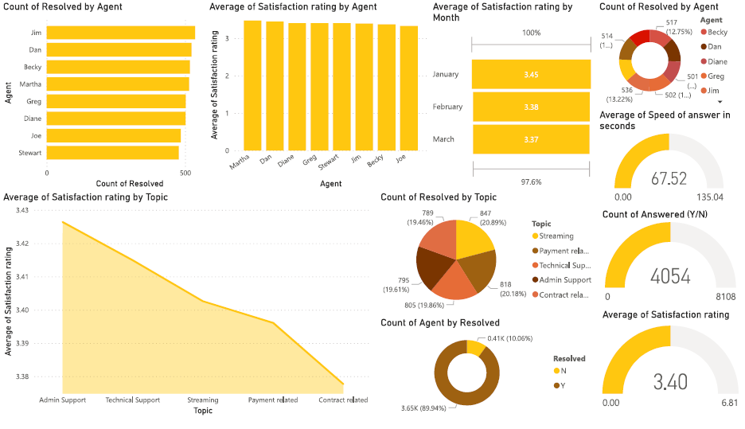
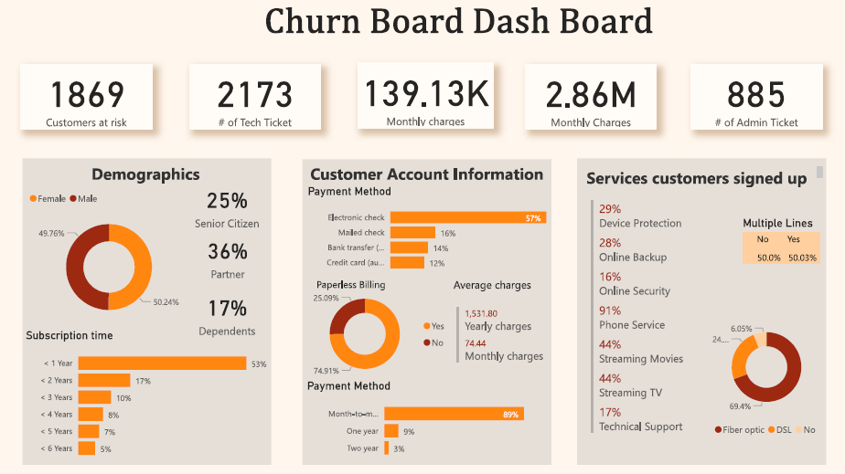
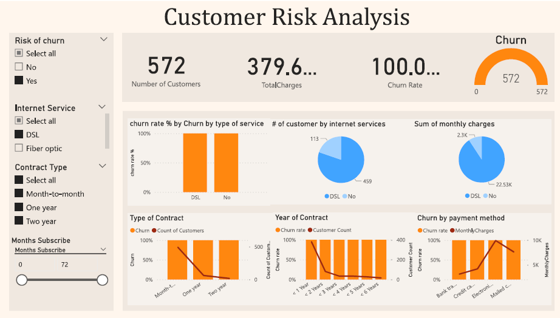
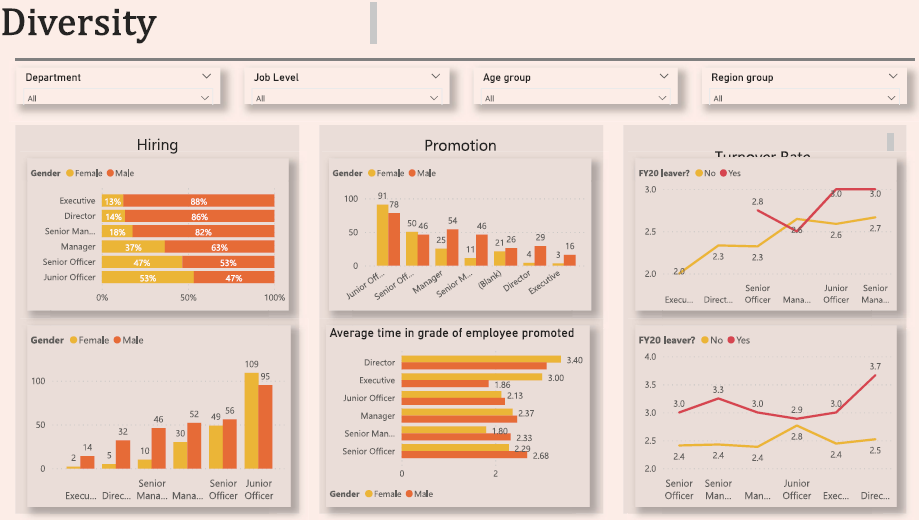
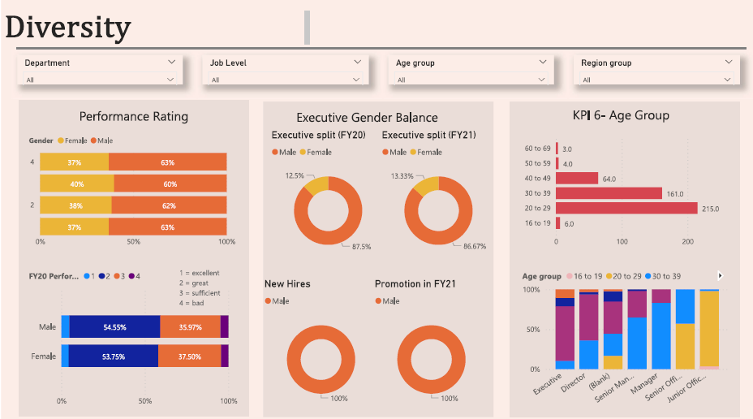

# PwC Virtual Case Experience: Power BI in Data Analytics

This repository contains dashboards created for three separate tasks at TheForage. These dashboards utilize real-world datasets to illustrate various business scenarios and steps to solve corresponding business problems. By leveraging Power BI, these dashboards empower users to identify patterns, risks, and opportunities within the data, enabling them to derive actionable insights.

## Task 1: Create Call Centre Dashboard - visualizing customer and agent behavior.

### Key Performance Indicators and Metrics:
#### About Calls and Agents:
Overall calls answered/abandoned
Calls received by time, day
Average speed of answer, handle duration
Resolved rate by Agents, Topics
Agent’s performance quadrant -> average handle time (talk duration) vs calls answered
#### About Customer satisfaction:
Overall customer satisfaction
Customer satisfaction distribution by Agents, Topics

### Analysis and Insights
The purpose of this dashboard is to serve as self-exploratory for managers, but I still note some highlighted points that I recognize below:

#### About Call trends:
Customers tend to call more between 5:00 pm - 5:30 pm at 250 calls received with an abandoned rate is 18.40% (approximately to the average abandoned rate) and distributed mainly in the middle of the month
The highest abandoned rate is 28.03% between 1:00 pm - 1:30 pm
Customers have more problems with Streaming service
The resolved rate is at a high rate (89,94%)
#### About performance of agents:
The agent who satisfies customers most is Becky with a 12.02% of “Very good” rating
The agent who has the highest resolved rate is Jim and he is effective with solving problems related to “Contract related” and “Admin Support”
#### About customer satisfaction:
The average customer satisfaction is at an acceptable rate with 3.40, mainly comes from “Average” (30.04%) and “Good” (29.11%) rating
The correlation between call answered and call resolved is strongly positive which resulted in a increase in the customer satisfaction rate

## Task 2: Create Customer Retention and predict churn customers - visualizing customer demographics and insights.

## Task 3: Create Diversity and Inclusion in HR - visualizing gender balance in the executive suite.

